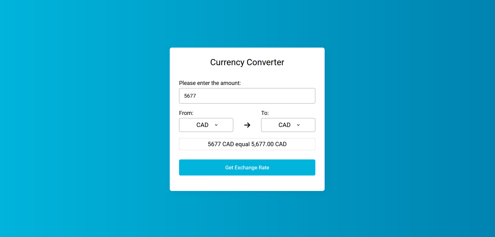

# The Dream 💱

SEE PROJECT: [lien du site](images/image_projet.png)

Project start : 15/11/2023

Project end : 17/11/2023

## Project description

Is a currency converter that allows users to check the exchange rate between ten currencies. The basic specifications include creating a web page with a form that submits data in PHP. The user should be able to enter the local rate, and the web page should display the number corresponding to the other rate using exchange rates obtained from an external API.

Must-have features include calculating the exchange rate, and using a form submitting data to PHP.

No JavaScript is allowed in this exercise.

## Technology used
- PHP
- CSS
- Currency conversion API

